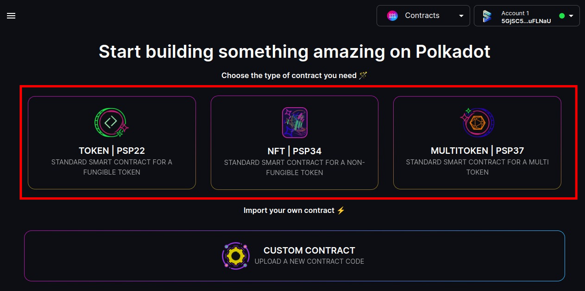
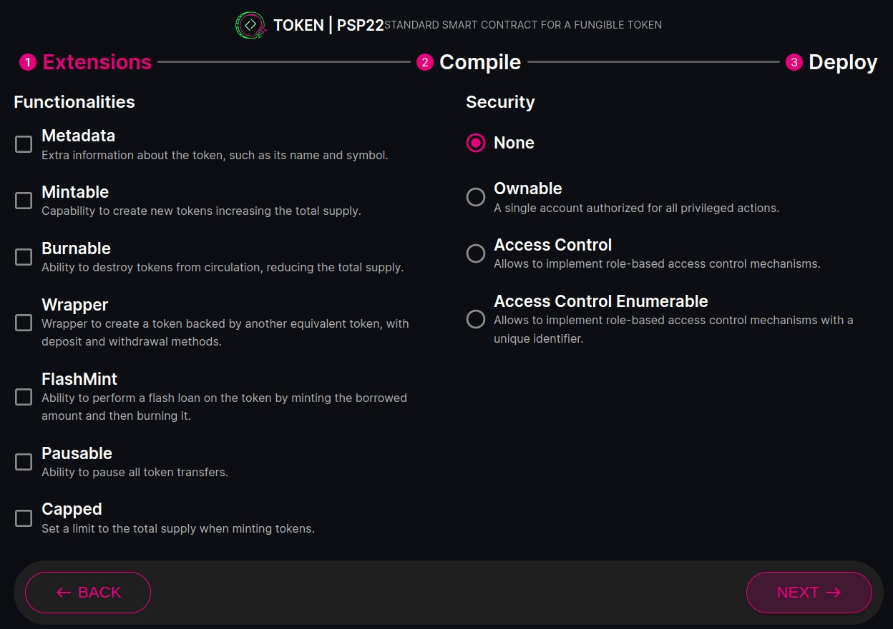
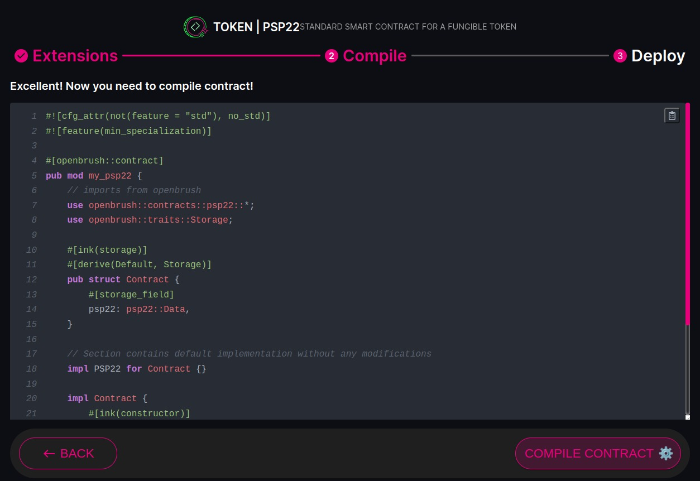
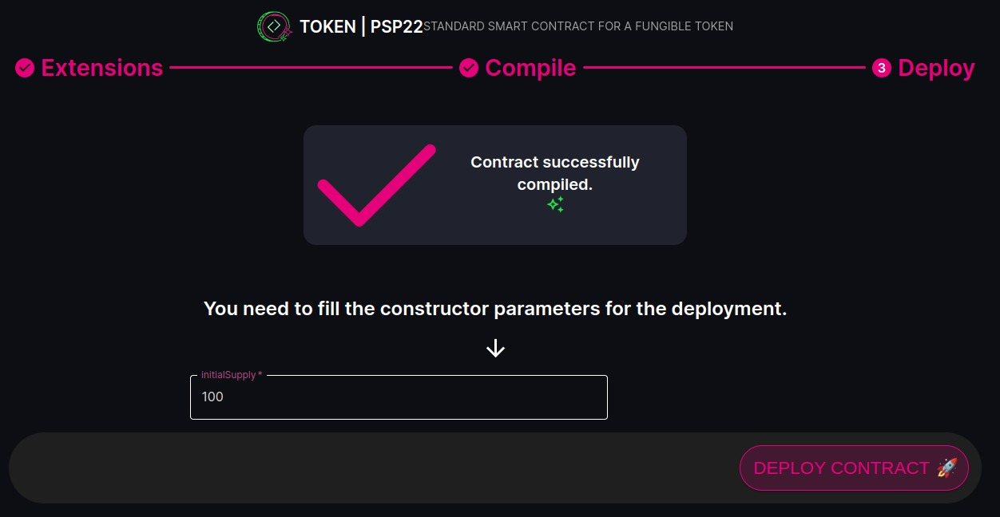
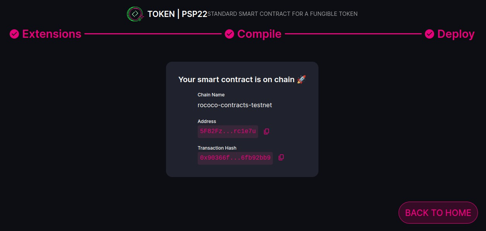
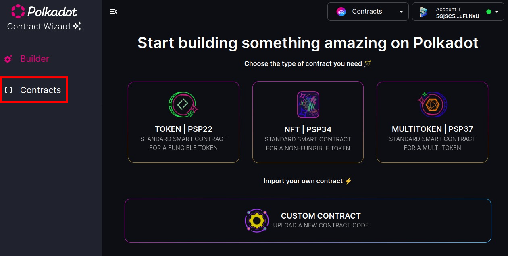
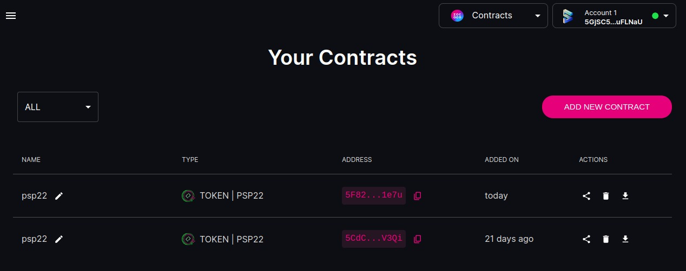
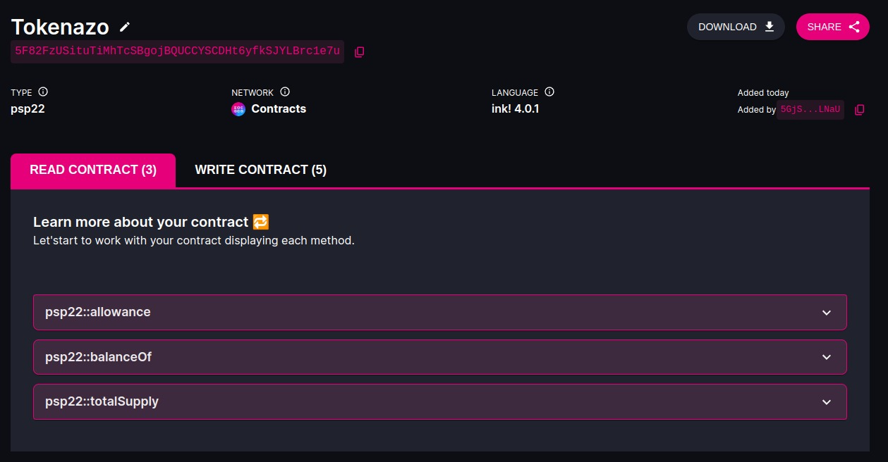
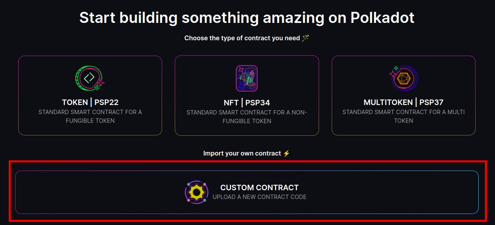
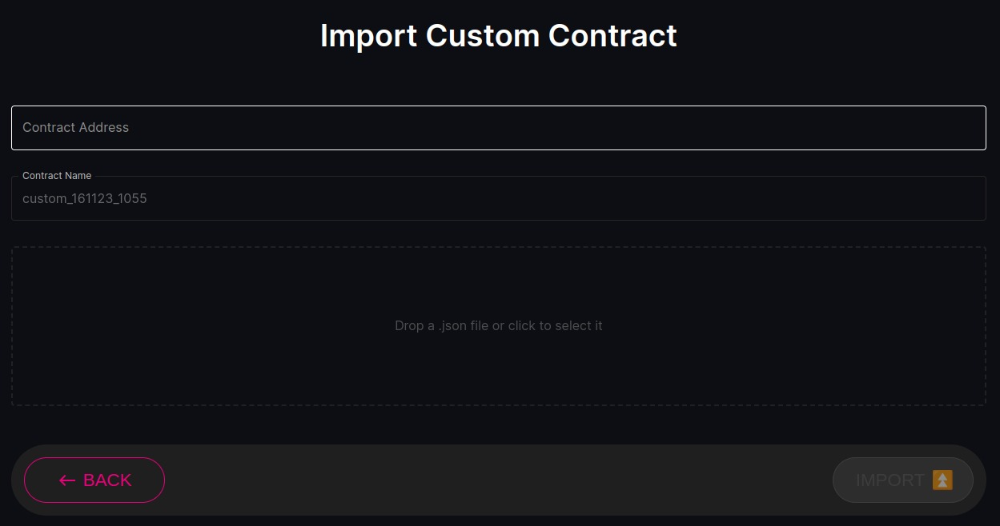

# Step-by-Step Tutorial

Navigating the world of smart contracts can seem daunting, especially if you're new to the blockchain realm. This tutorial aims to guide you through the process of creating, customizing, and deploying smart contracts using the Polkadot Contract Wizard (PCW).

## Creating a New Contract

### 1. Choosing a Contract Type:

- Access PCW: Open the Polkadot Contract Wizard in your web browser.

- Select Contract Type: On the main screen, you'll be presented with various contract types, such as Standard Token, Multi-Token, and NFT. Click on your desired contract type to proceed.

For further information about PSP check [this](../blog/Polkadot%20Standard%20Poposals%20-%20PSP)

### 2. Configuring Contract Extensions:

- View Extensions: Based on your chosen contract type, you'll see a list of available extensions.

For further information about Extensions check [this](../blog/Selectable%20options%20on%20each%20PSP%20contract)

- Customize: Select the extensions you wish to include in your contract. These extensions allow you to add specific functionalities to your contract.

- Proceed: Once you've made your selections, click on the "Next" button.

### 3. Compiling the Contract:

- Review: Before compiling, review your contract settings and chosen extensions to ensure everything is in order.

- Compile: Click on the "Compile" button. PCW will then process your contract. This might take a few moments.

For further information about WASM check [this](../blog/Deeper%20into%20smart%20contracts%20on%20Polkadot)

- Compilation Success: Once the compilation is successful, you'll receive a notification. If there are any issues, PCW will provide error messages to guide you on what needs fixing.

### 4. Deploying the Contract:

- Connect Wallet: Ensure your Polkadot-compatible wallet is connected and has the necessary funds for deployment.

- Deploy: Click on the "Deploy" button. PCW will guide you through the deployment process, including confirming the transaction in your wallet.

- Deployment Success: Once the contract is successfully deployed, you'll receive a confirmation along with details of your deployed contract.

## Interacting with Deployed Contracts

### 1. Access Your Contracts:

Navigate to the "Contracts" section in PCW to view a list of your deployed contracts.

### 2. Choose a Contract:

Click on the contract you wish to interact with.

### 3. Interact:

PCW provides a dynamic interface based on your contract's functionalities. Here, you can execute various actions, such as transferring tokens, minting new tokens, or any other functions your contract supports.
The read and write functionalities have been separated in different tabs for improved organization.

### 4. Review & Confirm:

Before executing any action, review the details and ensure everything is correct. Confirm the action in your connected wallet to finalize the transaction.

## Custom Contracts

If you have a custom contract not created through PCW, you can still interact with it:

### 1. Provide Contract Details:

Navigate to the "Custom Contracts" section and input the necessary details, such as metadata, network, and contract address.

### 2. Interact:

After PCW creates the interaction layout, you can engage with your custom contract in the same way as any other contract on the platform. You will have the ability to interact with the read and write functions, just as you would with contracts generated by the platform.